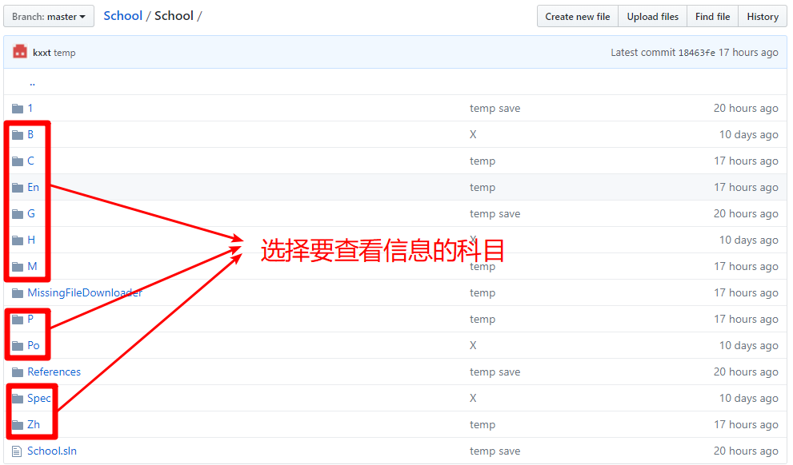

# School
> 此repo为Believers in Science Studio(科学信徒工作室)的所有学习资料的存储库，
> 为学习资料云共享平台基础设施，如果您不能完整的看到此文件，请点击下方的"View all of README.md"

## 代码含义
- 科目代号
  - Zh->语文
  - M->数学
  - En->英语
  - P->物理
  - C->化学
  - Po->政治
  - H->历史
  - G->地理
  - B->生物
  - I->信竞
- 科目同级代码
  - Spec->特殊
- 子级代码
  - Books->电子书
  - G->年级
  - J->初中
  - R->总复习

## 食用说明（会github的童鞋跳过）

## 版权
本repo中部分内容来自外部，若侵犯了您的版权，请联系bbsadmin@bbs.rswork.heliohost.org予以删除
未经特殊说明，本repo内文件在版权声明附带的前提下自由传播。

## 赞助
暂时不支持线上赞助,请线下赞助.

## 联系作者
email:[bbsadmin@bbs.rswork.heliohost.org](mailto:bbsadmin@bbs.rswork.heliohost.org)

blog:[https://rswork.heliohost.org](https://rswork.heliohost.org)

wire:@rsworktech

qq:1482619741,添加好友时注明"School项目 反馈".
